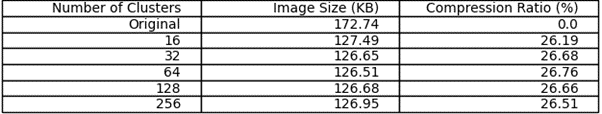

# Color Quantization Using K-Means for Social Impact in Kenya's Images

##  Overview
Images are an essential part of our digital world, used in everything from social media, education, healthcare to ecommerce websites.True-color images typically contain thousands of colors which makes storage, transmission, display and processing problematic. The  more images we use the more issues we face with website load times, storage space and bandwidth strains. This is where color quantization comes in.

Color quantization is the process of reducing the amount of color in an image in the case where the visual error between the original image and the quantized image is low.

## How K-means provides Image Quantization
The color pixels in an image are represented by their RGB values, which each range from 0 to 255. Since each color band has 256=2⁸ settings, there are a total of 256 ⋅ 256 ⋅ 256 = 256³ = 2²⁴ ~ 17 million colors. To represent each of these colors for any pixel, computers need log₂(2²⁴) = 24 bits of storage space. If we use K-means to select 16 colors that we represent an entire image with, we only need log₂(16) = 4 bits. Therefore, by using K-means with k=16, we can compress the image size by a factor of 6!

## Business Problem
Kenya faces challenges with limited bandwidth, resouce-constrained healthcare and digital preservation of cultural heritage.These challenges stem partly from large file sizes produced from high resolution images.

Harnessing the power of KMeans, a clustering algorithm that uses matrix algebra computation to group similar colors by  reducing the euclidean distance between the vector points, the image size will be significantly reduced with a relatively small visual error. A quantized image can unlock so many benefits for a developing country, some of them haave been listed below:

1. Reduced internet costs due to faster website load times especially for mobile data users in rural areas</li>
2. Increased access to telemedicine as smaller scan images can easily be transmitted for diagnosis</li>
3. Preservation and dissemination of Kenya's cultural heritage for future generations through digitization, archival of our cultural artifacts with minimal footprint, and sharing them online for educational fostering of awareness and appreciation of kenya's rich culture

        
## Data
The images in this data set were obtained from <a href="https://unsplash.com/">unsplash</a>.

        
## Metric of Success
To use KMeans to reduce the size of images with a small visual error.
        
## Experiment Design
1. Import the necessary libraries
2. Load the image and visualize
3. Flatten the image from3-dimensional to 2-dimensional array
4. Implement KMeans
5. Analyse the results
6. Conclusion
7. Recommendation

        
## Results

The results of the 16,32,64,128 and 256 color clusters in the image color quatization were obtained.We note that the size of the image is generally smaller than the original image. An incresea in the number of clusters increases the size of the reproduced image. As can be seen from the table and image visualizations above, a major advantage of color quantization is that the size of the RGB image is reduced, which greatly saves the storage space of the RGB image in the computer. When the computer processes the image, the RGB image with less memory can improve the processing speed and improve the research efficiency.
        
**Image quality based on the number of clusters**

        
**Image sizes after compression**

        
## CONCLUSION
K-Means-based algorithms are applied to RGB coconut tree. In the experiment, the number of cluster centres was set to 16,32,64,128 and 256, respectively, and the experimental results were obtained. A comprehensive analysis of the results of experiment yielded the following conclusions: 
1. The color quantization algorithm based on K-Means has a better effect on the color quantization of images. 
2. Colour quantization of RGB images can reduce image size. 

Therefore, the result of using the color quantization algorithm based on K-Means has a smaller visual error and consumes less memory space. Color quantization not only enables RGB images to be reproduced in more low-performance devices, improves image usability, but also saves computer storage space. It also improves image processing and transmission over the internet efficiently.

        
        
        
